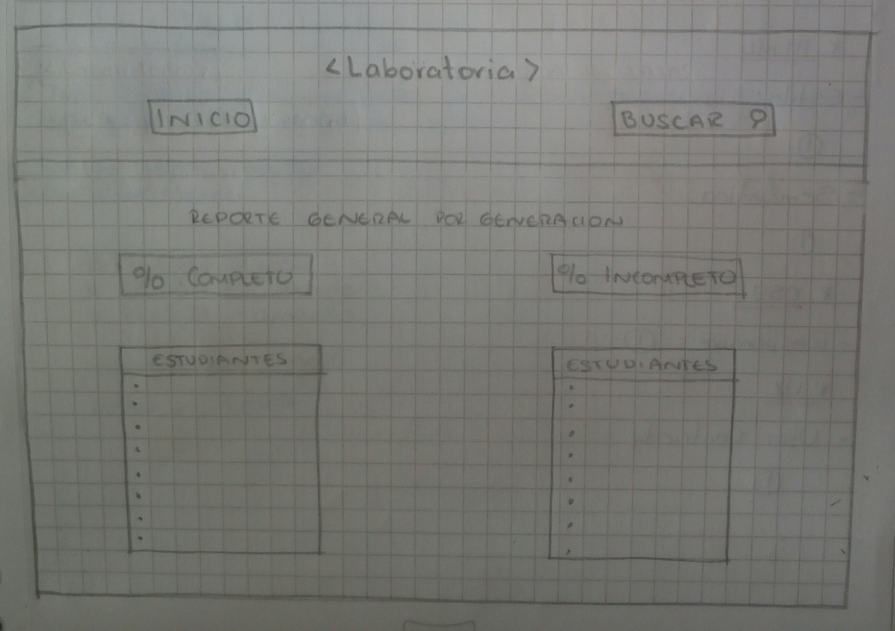

# **Data Dashboard**

## **Proceso de UX**

Nuestro primer acercamiento lo haremos a través del proceso de diseño, donde pasamos por diferentes etapas como:

### **1. Descubrimiento e investigación**

__¿Qué es un Data Dashboard?__     

Un *Data Dashboard* podría definirse como "La Representación Gráfica de los indicadores KPI (Key Performance Indicator, indicador clave o medidor de desempeño) que intervienen en la consecución de los objetivos de negocio, y que está orientada la toma de desiciones para optimizar la estrategia de la empresa. Un *Data Dashboard* debe transformar los datos en información y estar en conocimiento para el negocio".

La persona que toma las desiciones debe ser capaz de interpretar facilmente la información que está viendo, por lo que el *Data Dashboard* debe ser breve, hablar el mismo lenguaje del descisor y su representación gráfica la adecuada para los datos que representa y lo suficientemente visual, para que resulte atractivo su estudio.

Un *Data Dashboard* permite hacer un seguimiento del grado de cumplimiento de los objetivos del negocio o sector.

Un *Data Dashboard* es una "foto fija" de los principales indicadores de nuestro negocio, no un lugar donde estudiar determinado tema, cruzar variables, etc.

Un *Data Dashboard* debe ayudar al usuario a identificar el origen de ese dato positivo o negativo que hemos detectado, que nos permita tomar una desición al respecto.

https://tristanelosegui.com/2014/10/27/que-es-y-para-que-sirve-un-dashboard/

5__Usuarixs:__  
Este programa está enfocado principalmente a las Training Managers de Laboratoria, quienes se encargan, entre otras cosas, de dar un  seguimiento al aprendizaje de  las estudiantes y  poder evaluar las situaciones en las que cada una se encuentra; sin embargo, esta información tambien podrá ser interpretada y tendrán acceso otras areas de Laboratoria.

__Necesidades de las usuarias:__
Poder acceder a la data rapidamente y  de forma clara y resumida los avances de las alumnas, todo con respecto al sistems LMS, el cual estara dividido basicamente en dos partes, Completo e Incompleto. 

__Objetivos de las usuarias:__ 
Analizar e identificar la mayor cantidad de datos posibles y realizar un diagnóstico de grupo.

__Pain points:__ 
Tener múltiples documentos con data separada y obligadas por esto, tener que utilizar fórmulas y procesos largos para procesarla.

__Sentimientos:__ 
Principalmente, frustración, enojo y pocas ganas de dar un seguimiento.

__Técnicas usadas en esta fase:__ 
Se créo un formulario, el cual fué enviado a un usurario directo "Training Manager" y nos acercamos a un "couch" quien dió opinion de lo que busca en una herramienta como esta.

__5. Objetivos del negocio:__ 
- Unificar criterios para manejar la Data.

__6. Motivaciones del negocio para el data dashboard:__
- Acceder a la Data fácilmente y visualizarla rápido.

### **2. Síntesis y definición**

Tomando en consideración lo antes mencionado, se obtiene lo siguiente:

El usuario nos ha hecho llegar una petición para elaborar un programa que recopile, manipule y muestre información, todo referente a los avances que las alumnas van teniendo en las diferentes activiades que se encuentran en el sistema LMS y el cual  se les proporciona  durante el Bootcamp dentro de Laboratoria, hemos revisado la información que ha sido proporcionada por el equipo, en ella se hace mención de las características principales con las que debe contar esta herramienta, básicamente  se tiene toda la data de cada una de las estudiantes Tambien se ha realizado una breve entrevista a un par de usuarios para conocer mas a fondo lo que esperan de este producto.

__1. Cuáles crees que son los datos más importantes a tener en cuenta para el Data Dashboard:__

   - Sobre las estudiantes:
   - Sede y Generacion a la que pertenecen.
   - Nombre de la estudiante.
   - Porcentajes de completitud dentro del estudio LMS, con esto se tendría una idea del avance de la estudiante.
   - Reporte General de completitud por Generación.
 

__2. Lo que los usuarios esperan obtener:__

- Fácil acceso a la información.
- Que pueda ser analizada/visualizada de forma sencilla.

__3. Data proporcionada:__ 

   _Data relacionada a los cursos:_
   - Progreso:
    - - Duración del programa.
    - - Porcentaje de avance/completitud.
    - 
    
    - Temas:
    - - Nombre
    - - Duración por tema.
    - - Duración por tema completado.
    - - Porcentaje completado por tema.
     
    - Subtemas:
    - - Nombre
    - - Porcentaje completado.
    - - Duración subtema.
    - - Tipo.
    
    - Numero de Subtemas completados.
    - Subtemas totales.

__5. Insights del negocio:__

- Unificar criterios para manejar la Data.
- Facilidad de análisis de acuerdo a la Data

### **3. Ideación**
Se craerá un progrma que a la vista del usuario sea agradable y cuyos contenidos principales (botones de acceso) sean lo suficientemente claros para que el usuario identifique que tipo de informacion podrá obtener al seleccionar cualquiera de ellos.

### **4. Prototipado**
A continuacion se hace una descripcion por sketch:

Sketch 1: 

Se crea una seccion cuyo contenido sera invariable durante la interacción entre sus paginas, dentro se coloca el logotipo de la empresa/sector, que identificará que pertenece a ellos, además se eligieron los colores con los que  Laboratoria se identifica, se tiene también un boton de INICIO, el cual redireccionará a ésta página principal cada vez que usuario desee observar Data diferente, esto peremite al usuario omitir "ir hacia atras" constantemente. Se colocá una barra de busqueda que permitirá al usuario Buscar a una Estudiante por Nombre, mostrando informacion referente a los porcentajes de Completitd de la Estudiante.

La informacioón que el usuario podrá manipular será la siguiente:

- SEDES: El usuario podrá seleccionar la SEDE a la que desee ingresar
- GENERACION: Después de lo anterior, el usuario podrá seleccionar la GENERACION de la SEDE  seleccionada anteriormente.
- Se habilitaran dos botones con nombre 1) ESTUDIANTES POR GENERACIÓN y 2) REPORTE GENERAL POR GENERACION.
-  ESTUDIANTES POR GENERACION y REPORTE GENERAL POR GENERACION: Estos botones se activarán una vez que el usuario haya seleccionado una SEDE y una GENERACION.

Sketch 2:

Si el usuaro elige la opcion 1) ESTUDIANTES POR GENERACION, se le mostrará la siguiente informacion según SEDES Y GENERACION

- ESTUDIANTES POR GENERACION: Este botón se activará una vez que el usuario haya seleccionado una SEDE y una GENERACION, y se mostrara la siguiente informacion:

- Nombre de la Estudiante y correo electrónico.
- Progreso dentro de LMS
- Temas:  Duración por tema - Duracion por tema completado - Porcentaje Completado
- Subtemas:  Completado - Duración subtema - Tipo

Sketch 3:

Si el usuario elige la opcion 2) REPORTE GENERAL POR GENERACION, se le mostrará la siguiente información segun SEDE y GENERACION:
- Porcentaje de Estudiantes con LMS Completo
- Listado de estudiantes dentro de este porcentaje
- Porcentaje de Estudiantes con LMS Incompleto
- Listado de Estudiantes dentro de este porcentaje

Prototipo en figma: (https://www.figma.com/file/YxMbOnCY0H0hsrVm0Az1aE2r/Untitled)

### **5. User testing**
Se muestra prototipo con Feedback aplicado, se hace mención a los colores y botones de acceso.
****